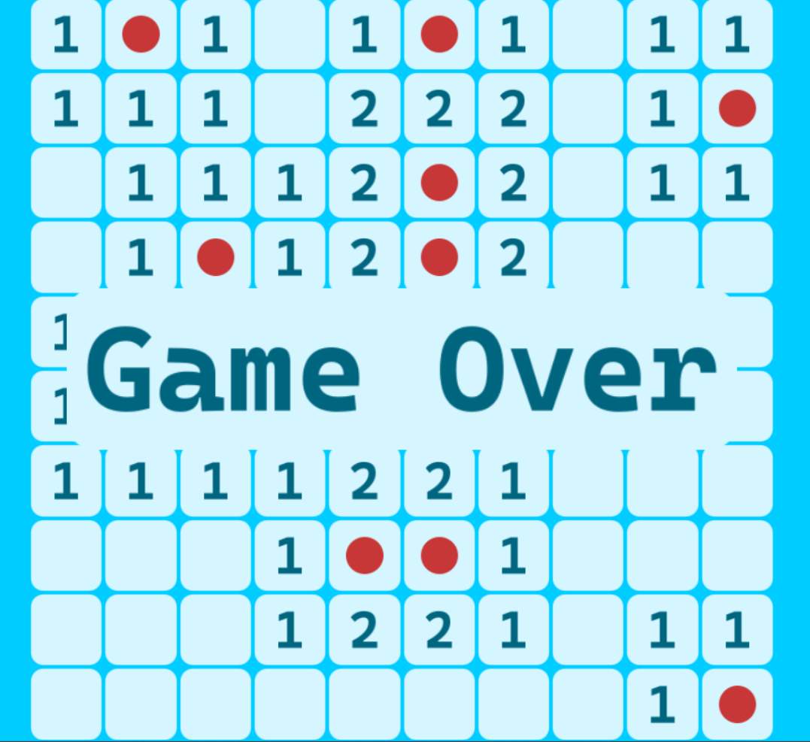

# Minesweeper

## Building

### Windows

Run 
```
setup.bat
```

Open `Minesweeper.sln` in [Visual Studio 2022](https://visualstudio.microsoft.com/), compile and run

### Linux

Run 
```
setup.sh
```

---
For building with other compilers use [premake](https://premake.github.io/)


## Game

The game has a 10 by 10 grid consisting of 10 mines


